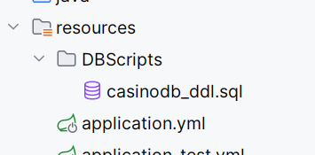

# Getting Started

- ### Prerequisites

  - Java 11 or higher
  - Maven 3.6.3 or higher
  - PostgreSQL

- ### **Installation**

  **1. Clone the repository:**

    ```bash
    $ git clone https://github.com/jazzcowboy616/casino.git
    $ cd casino
    ```

  **2. Create the database:**

   ```sql
   CREATE
   DATABASE casinodb
      WITH
      OWNER = postgres
      ENCODING = 'UTF8'
      LC_COLLATE = 'en_US.UTF-8'
      LC_CTYPE = 'en_US.UTF-8'
      LOCALE_PROVIDER = 'libc'
      TABLESPACE = pg_default
      CONNECTION LIMIT = -1
      IS_TEMPLATE = False;
   ```

  **3. Configure the database:**

   ```yaml
   # `application.yml`
   spring:
      datasource:
         driver-class-name: org.postgresql.Driver
         url: jdbc:postgresql://localhost:5432/casinodb
         username: username
         password: password
   ```

  **4. Execute DDL and DML scripts:**

  You can directly execute the DDL and DML scripts in the `src/main/resources/DBScripts` directory to create the tables
  and insert the initial data.

  

  Of course, you can also change the jpa config in `application.yml` to let application create the tables automatically.

    ```yaml
      jpa:
        open-in-view: true
        hibernate:
          ddl-auto: validate  <-- change to 'update' to enable DDL handling
        show-sql: false
        properties:
          hibernate:
            format_sql: true
    ```

- ### **Run**

  **Linux:**

   ```bash
   cd ${application.home}
   ./mvn spring-boot:run
   ```

  **Windows:**

   ```bash
   cd ${application.home}
   mvnw.cmd spring-boot:run
   ```
  
  ```
  .   ____          _            __ _ _
  /\\ / ___'_ __ _ _(_)_ __  __ _ \ \ \ \
  ( ( )\___ | '_ | '_| | '_ \/ _` | \ \ \ \
  \\/  ___)| |_)| | | | | || (_| |  ) ) ) )
  '  |____| .__|_| |_|_| |_\__, | / / / /
  =========|_|==============|___/=/_/_/_/
  
  :: Spring Boot ::                (v3.3.1)
  
  2025-03-28T17:07:01.408-07:00  INFO 36332 --- [casino] [           main] org.omega.casino.CasinoApplication       : Starting CasinoApplication using Java 17.0.10 with PID 36332 (C:\Work\java\Workspace\casino\target\classes started by w_hun in C:\Work\java\Workspace\casino)
  2025-03-28T17:07:01.410-07:00  INFO 36332 --- [casino] [           main] org.omega.casino.CasinoApplication       : No active profile set, falling back to 1 default profile: "default"
  2025-03-28T17:07:01.940-07:00  INFO 36332 --- [casino] [           main] .s.d.r.c.RepositoryConfigurationDelegate : Bootstrapping Spring Data JPA repositories in DEFAULT mode.
  2025-03-28T17:07:01.989-07:00  INFO 36332 --- [casino] [           main] .s.d.r.c.RepositoryConfigurationDelegate : Finished Spring Data repository scanning in 44 ms. Found 4 JPA repository interfaces.
  2025-03-28T17:07:02.202-07:00  WARN 36332 --- [casino] [           main] trationDelegate$BeanPostProcessorChecker : Bean 'org.springframework.ws.config.annotation.DelegatingWsConfiguration' of type [org.springframework.ws.config.annotation.DelegatingWsConfiguration$$SpringCGLIB$$0] is not eligible for getting processed by all BeanPostProcessors (for example: not eligible for auto-proxying). The currently created BeanPostProcessor [annotationActionEndpointMapping] is declared through a non-static factory method on that class; consider declaring it as static instead.
  2025-03-28T17:07:02.225-07:00  INFO 36332 --- [casino] [           main] .w.s.a.s.AnnotationActionEndpointMapping : Supporting [WS-Addressing August 2004, WS-Addressing 1.0]
  2025-03-28T17:07:02.401-07:00  INFO 36332 --- [casino] [           main] o.s.b.w.embedded.tomcat.TomcatWebServer  : Tomcat initialized with port 8080 (http)
  2025-03-28T17:07:02.409-07:00  INFO 36332 --- [casino] [           main] o.apache.catalina.core.StandardService   : Starting service [Tomcat]
  2025-03-28T17:07:02.409-07:00  INFO 36332 --- [casino] [           main] o.apache.catalina.core.StandardEngine    : Starting Servlet engine: [Apache Tomcat/10.1.25]
  2025-03-28T17:07:02.456-07:00  INFO 36332 --- [casino] [           main] o.a.c.c.C.[Tomcat].[localhost].[/]       : Initializing Spring embedded WebApplicationContext
  2025-03-28T17:07:02.456-07:00  INFO 36332 --- [casino] [           main] w.s.c.ServletWebServerApplicationContext : Root WebApplicationContext: initialization completed in 1011 ms
  2025-03-28T17:07:02.538-07:00  INFO 36332 --- [casino] [           main] o.hibernate.jpa.internal.util.LogHelper  : HHH000204: Processing PersistenceUnitInfo [name: default]
  2025-03-28T17:07:02.583-07:00  INFO 36332 --- [casino] [           main] org.hibernate.Version                    : HHH000412: Hibernate ORM core version 6.5.2.Final
  2025-03-28T17:07:02.608-07:00  INFO 36332 --- [casino] [           main] o.h.c.internal.RegionFactoryInitiator    : HHH000026: Second-level cache disabled
  2025-03-28T17:07:02.691-07:00  INFO 36332 --- [casino] [           main] com.zaxxer.hikari.HikariDataSource       : HikariPool-1 - Starting...
  2025-03-28T17:07:02.838-07:00  INFO 36332 --- [casino] [           main] com.zaxxer.hikari.pool.HikariPool        : HikariPool-1 - Added connection org.postgresql.jdbc.PgConnection@7e2bd5e6
  2025-03-28T17:07:02.840-07:00  INFO 36332 --- [casino] [           main] com.zaxxer.hikari.HikariDataSource       : HikariPool-1 - Start completed.
  2025-03-28T17:07:03.087-07:00  INFO 36332 --- [casino] [           main] o.s.o.j.p.SpringPersistenceUnitInfo      : No LoadTimeWeaver setup: ignoring JPA class transformer
  2025-03-28T17:07:03.824-07:00  INFO 36332 --- [casino] [           main] o.h.e.t.j.p.i.JtaPlatformInitiator       : HHH000489: No JTA platform available (set 'hibernate.transaction.jta.platform' to enable JTA platform integration)
  2025-03-28T17:07:03.940-07:00  INFO 36332 --- [casino] [           main] j.LocalContainerEntityManagerFactoryBean : Initialized JPA EntityManagerFactory for persistence unit 'default'
  2025-03-28T17:07:04.149-07:00  INFO 36332 --- [casino] [           main] o.s.d.j.r.query.QueryEnhancerFactory     : Hibernate is in classpath; If applicable, HQL parser will be used.
  2025-03-28T17:07:04.584-07:00  INFO 36332 --- [casino] [           main] eAuthenticationProviderManagerConfigurer : Global AuthenticationManager configured with AuthenticationProvider bean with name authenticationProvider
  2025-03-28T17:07:04.586-07:00  WARN 36332 --- [casino] [           main] r$InitializeUserDetailsManagerConfigurer : Global AuthenticationManager configured with an AuthenticationProvider bean. UserDetailsService beans will not be used for username/password login. Consider removing the AuthenticationProvider bean. Alternatively, consider using the UserDetailsService in a manually instantiated DaoAuthenticationProvider.
  2025-03-28T17:07:05.046-07:00  INFO 36332 --- [casino] [           main] o.s.b.w.embedded.tomcat.TomcatWebServer  : Tomcat started on port 8080 (http) with context path '/'
  2025-03-28T17:07:05.053-07:00  INFO 36332 --- [casino] [           main] org.omega.casino.CasinoApplication       : Started CasinoApplication in 4.015 seconds (process running for 4.45)
  ```

  Now you can access the application at `http://localhost:8080`

  _**Note:** log file at `logs/casino.log`_

- ### **Data Import**
  You can import games through upload API by a prepared xml file

  #### xml example:
  ```xml
  <games>
      <game>
          <name>Blackjack</name>
          <description>Black jack</description>
          <winRate>0.45</winRate>
          <winMultiplier>2.0</winMultiplier>
          <minBet>5.00</minBet>
          <maxBet>100.00</maxBet>
      </game>
      <game>
          <name>Roulette</name>
          <description>Roulette game</description>
          <winRate>0.48</winRate>
          <winMultiplier>3.0</winMultiplier>
          <minBet>2.00</minBet>
          <maxBet>200.00</maxBet>
      </game>
  </games>
  ```